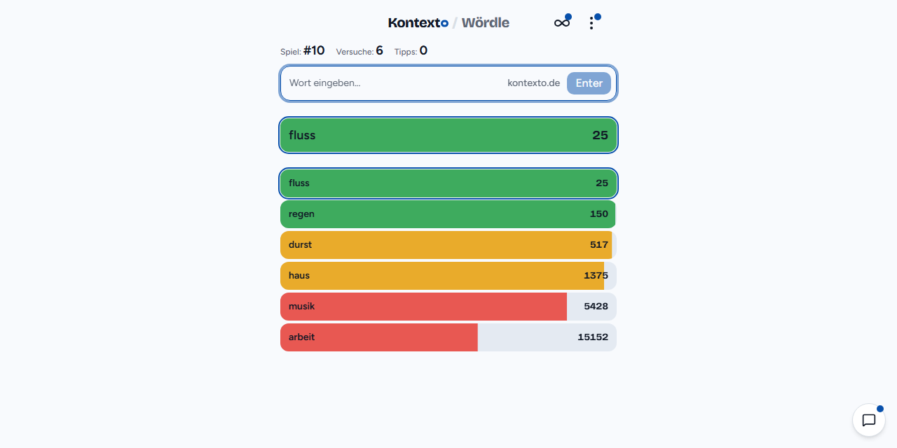
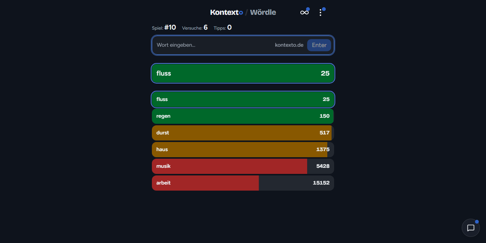
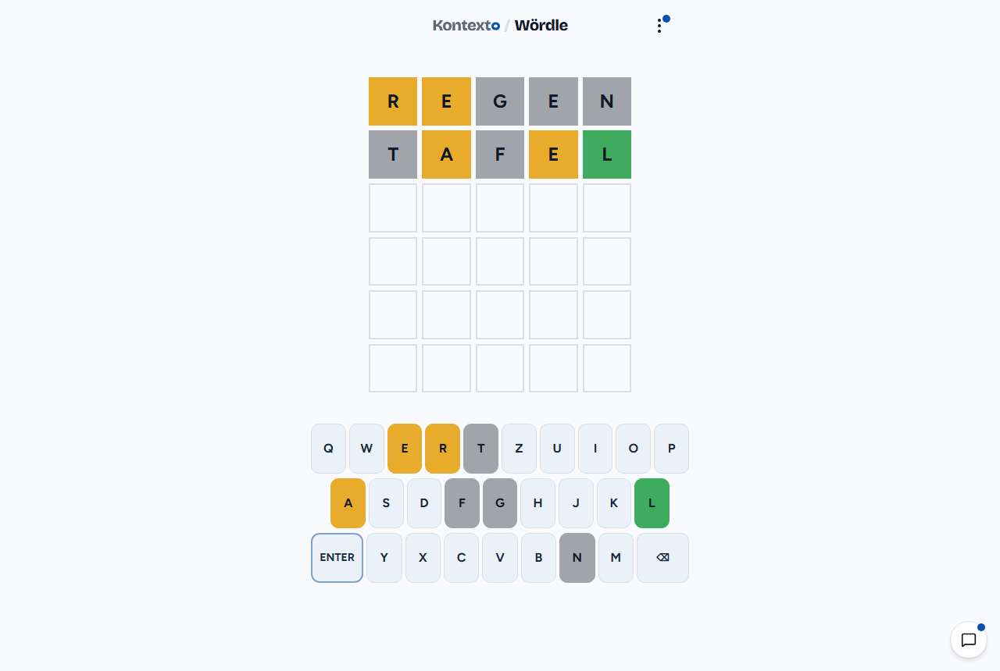
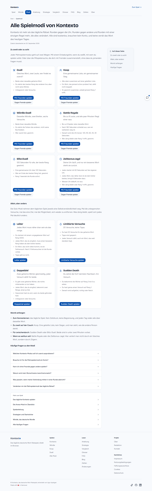
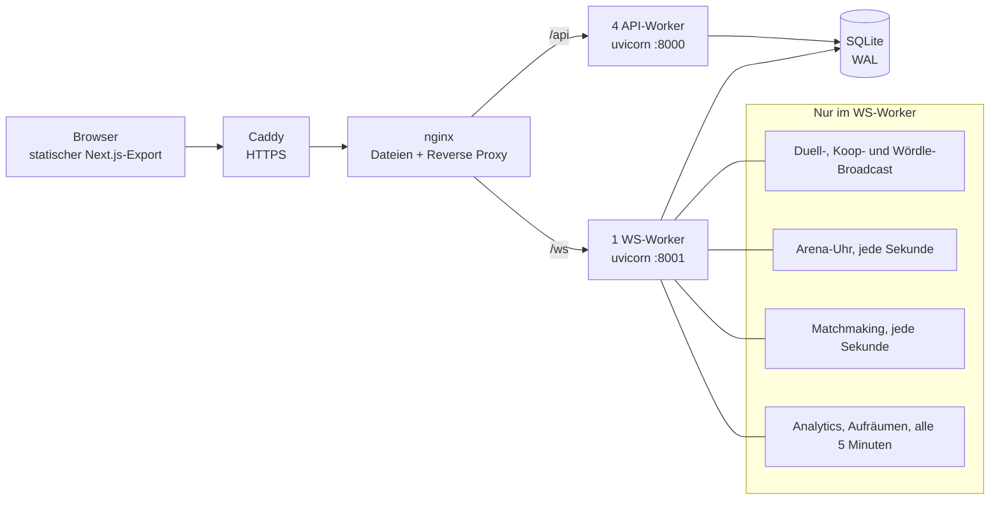
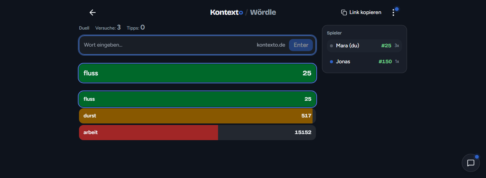

<div align="center">

# Kontexto

**Errate das geheime Wort. Jeder Versuch bekommt einen Rang, und der Rang verrät dir, wie nah du semantisch dran bist.**

[kontexto.de](https://kontexto.de) · Wördle · vier Solo-Regelsätze · Duell, Koop und drei Arenamodi in Echtzeit

[](LICENSE)
[](https://fair.io/)
[](https://nextjs.org)
[](https://fastapi.tiangolo.com)
[](https://github.com/LuckyBulgur/kontexto/actions/workflows/deploy.yml)



</div>

---

## Was das hier ist

Du tippst ein Wort ein, der Server antwortet mit einer Zahl. Rang 1 ist die
Lösung, Rang 2 ist das semantisch nächste Wort, Rang 15152 ist weit weg. Mehr
Regeln gibt es nicht. Aus dieser einen Zahl entsteht das Spiel: du tastest dich
durch ein Bedeutungsfeld, merkst an den Rängen, in welche Richtung es wärmer
wird, und irgendwann kippt es.

Kontexto ist die deutsche Umsetzung dieser Mechanik, inspiriert von
[Contexto.me](https://contexto.me) von Nildo Junior, und inzwischen ein Stück
weiter: dazugekommen sind **Wördle**, vier Solomodi mit eigenen Regeln, drei
Echtzeit-Mehrspielermodi plus zwei Arenavarianten mit Uhr, eine
Zufallssuche, die vor allen Räumen sitzt, eine Tippfehlerkorrektur und ein
Designsystem mit fünf Farbwelten.

| | |
|-|-|
|  |  |
| **Dunkler Modus.** Die Rangrampe bleibt in jeder Farbwelt gleich, weil der geteilte Ergebnistext sie als Emoji-Quadrate buchstabiert. | **Wördle.** Fünf Buchstaben, sechs Versuche, deutsche Wortliste aus dem eigenen Vokabular abgeleitet. |

## Die Modi

**Kontexto solo**

| Modus | Regel |
|-|-|
| Tagesrätsel | Ein Wort pro Tag, unbegrenzt viele Versuche, drei Tippstufen. |
| Leiter | Startet auf Rang 5000. Jedes Wort muss näher dran sein als dein bisher bestes. Drei Fehlversuche, dann ist Schluss. |
| Limitierte Versuche | 20 Versuche, keine Tipps. |
| Doppelziel | Zwei geheime Wörter gleichzeitig, jeder Versuch bekommt zwei Ränge. |
| Sudden Death | Du siehst die Wörter auf Rang 2 bis 6 und hast genau einen Versuch auf Rang 1. |

**Gegeneinander und miteinander**

| Modus | Regel |
|-|-|
| Duell | Gleiches Wort, zwei Leute, wer findet es zuerst. |
| Koop | Eine gemeinsame Liste, ein gemeinsamer Sieg. |
| Wördle-Duell | Dasselbe Wördle, zwei Bretter, sechs Versuche. |
| Battle Royale | Bis zu acht Leute, alle paar Minuten fliegt der hinterste raus. |
| Blitz-Duell | 120 Sekunden für alle, der beste Rang gewinnt. |
| Zeitbonus-Jagd | Deine Uhr läuft, und nur ein besseres Wort dreht sie zurück. |

Vor allen sechs sitzt eine gemeinsame Warteschlange: unter `/suche/` wählst du
einen Modus und bekommst Mitspieler zugelost, statt einen Link verschicken zu
müssen.



## Wie es funktioniert

### Zur Laufzeit rechnet nichts

Das ist die eine Entscheidung, an der alles andere hängt. Es gibt **kein
Embedding-Modell im laufenden Betrieb**. `backend/prepare.py` lädt offline das
deutsche fastText-Modell, entzerrt die Vektoren (Mittelwert und die drei
stärksten Hauptkomponenten raus, „All but the Top"), rechnet für jedes
Lösungswort die Kosinusähnlichkeit zum gesamten Vokabular aus und schreibt das
Ergebnis als fertiges Rangarray nach `data/games/{NNNN}.npz`.

Ein Tipp im Spiel ist danach ein Dictionary-Zugriff und ein Arrayindex, O(1).
Das Spiel braucht keine GPU, kein Modell im Speicher und keine Warmlaufzeit,
und es antwortet in unter einer Millisekunde.

### Was Lösung sein darf

Seit dem 21. September 2026 ist eine Kontexto-Lösung ein **konkretes
Gattungssubstantiv**, sonst nichts. Verben und Adjektive bleiben erlaubte
Tipps, sie sind nur keine Antworten mehr. Der Grund ist gemessen, nicht
behauptet: auf der Produktion kostet eine Lösung, die die deutschen
Konkretheitsnormen unter 4,0 bewerten, im Schnitt 118 Versuche pro gelöstem
Spiel, eine mit 7,0 oder mehr nur 48. Ganze Häufigkeitsbänder unterscheiden
sich dagegen um kaum ein Drittel. Deshalb liegt die Häufigkeitsschwelle auch
nur bei Zipf 2,5: ein seltenes, aber vorstellbares Wort (`maiskolben`,
`pelikan`, `streichholz`) ist die bessere Runde als ein häufiges abstraktes.

Zwei Filter tragen die Regel (`backend/target_selection.py`), dazu eine
Handliste für das, was keine Automatik erwischt. Die Zahlen und die Herleitung
stehen in [`docs/plans/2026-09-21-concrete-noun-pool.md`](docs/plans/2026-09-21-concrete-noun-pool.md).

### Vertippt ist nicht verloren

Ein Wort, das nicht im Vokabular steht, wird nicht sofort abgelehnt.
`backend/spellfix.py` hält einen Symmetric-Delete-Index (SymSpell) über jede
Oberflächenform, rund 25 MB im Speicher, 0,05 ms pro Abfrage. Die Regeln sind
absichtlich eng: ein bekanntes Wort wird nie umgeschrieben, ausgeschriebene
Umlaute (`haeuser`, `strasse`) lösen sich immer auf, ein einzelner Kandidat mit
Editierdistanz 1 wird gewertet, alles andere kommt als 404 mit bis zu drei
Vorschlägen zum Antippen zurück.

Die Vorschläge sind nach Editierdistanz und deutscher Worthäufigkeit sortiert,
**nie** nach ihrem Rang im laufenden Spiel. Andersherum wäre die Korrektur ein
kostenloser Tipp.

### Namen

Ein Nickname ist der einzige freie Text im Spiel, alle im Raum lesen ihn, und
ein Einladungslink wird weitergeschickt. Deshalb läuft `sanitize_nickname` an
jeder Tür: in `create_*` und `join_*` von Duell, Koop, Arena und Wördle-Duell
und in der Warteschlange.

Ein beleidigender Name wird **nicht abgelehnt, er wird gespiegelt**. Wer
`Hurensohn` eintippt, spielt als `Ich bin H*******n`. Die Maske entsteht aus
dem Listeneintrag, nicht aus der Schreibweise, also ergeben `HURENSOHN`,
`hur3nsohn` und `xxHurensohnxx` denselben Namen. Es gibt keine Rückmeldung,
dass der Filter angesprungen ist: eine Ablehnung mit Meldung ist eine
Messsonde (eintippen, Fehler lesen, nachjustieren), eine stille Umbenennung
gibt nichts her, woran man kalibrieren könnte.

## Architektur



Eine FastAPI-Anwendung, zwei Rollen. Die vier API-Worker bedienen das Spiel,
der eine WS-Worker hält die WebSockets und ist **der einzige Prozess mit
Hintergrundschleifen**, damit es für jeden periodischen Schreibvorgang genau
einen Schreiber gibt.

Zwischen den Workern gibt es **keinen gemeinsamen Speicher**. SQLite ist die
einzige Wahrheit, und deshalb muss jeder Schreibvorgang idempotent sein:
HyperLogLog-Register per `MAX`-Upsert, Tageszähler per Upsert, jeder
Zustandsübergang in der Arena mit einer Bedingung auf den erwarteten Zustand
(`WHERE status = 'running' AND deadline_at <= ?`). Ein zweiter Durchlauf
derselben Sekunde ändert dann nichts mehr.

**Die Zeit gehört dem Server.** Jede Arenafrist ist ein absoluter
UTC-Zeitstempel fester Breite, sodass SQLites Zeichenkettenvergleich ein
Zeitvergleich ist. Der Client bekommt ihn zusammen mit `server_time` und
korrigiert damit seine eigene Uhr. Der Ratepfad weist einen zu späten Tipp
selbst ab (409 `time_up`), damit niemand die Schlusssirene im
Ein-Sekunden-Fenster des Auswerters schlägt.



### Analytik ohne Cookies

Die zählbaren Werte (Tipps, Lösungen, Hinweise, Duelle) zählt **der Server in
den echten Handlern**, nie der Client. Die Besucheridentität ist ein
anonymer, nicht umkehrbarer Fingerabdruck `SHA256(IP + User-Agent + Monatssalz)`,
der in HyperLogLog-Skizzen einfließt; daraus kommt die Schätzung der
Einzelbesucher, ohne dass irgendwo eine Besucherliste entsteht. Rohereignisse
werden nach 35 Tagen gelöscht, dauerhaft bleiben nur Aggregate.

Vom Client stammt genau eine Sorte Zahl, die Verteilungshistogramme der
Abschlüsse, und die sind tokengebunden, botgefiltert und dedupliziert. Es gibt
keine Cookies, keine Drittanbieteranalytik und keinen Consent-Banner, weil es
nichts einzuwilligen gibt.

## Schnellstart

### Mit Docker

```bash
docker compose up --build
```

Danach läuft die App auf `http://localhost:8080`. Der erste Start baut das
Frontend, lädt das fastText-Modell und rechnet die Spieldaten aus, das dauert.

### Lokal entwickeln

Voraussetzungen: **Node ≥ 24 mit pnpm** (npm wird nicht unterstützt) und
**Python 3.12**.

```bash
# Spieldaten, einmalig. Lädt das deutsche fastText-Modell und rechnet die Rangarrays.
bash scripts/prepare-data.sh data/

# Backend
cd backend
python -m venv .venv && source .venv/bin/activate && pip install -r requirements.txt
KONTEXTO_DEV=1 KONTEXTO_DATA_DIR=../data uvicorn main:app --reload

# Frontend, zweites Terminal
cd frontend
pnpm install
pnpm dev
```

`KONTEXTO_DEV=1` schaltet CORS für die lokale Entwicklung frei und erlaubt ein
Entwicklungsgeheimnis, statt den Start ohne `KONTEXTO_SERVER_SECRET` zu
verweigern. Der Entwicklungsserver ist ein einzelner Prozess ohne
Hintergrundschleifen; für Echtzeitmodi brauchst du den Docker-Stack.

Wenn du die schweren Spieldaten nicht bauen willst, reicht für fast alles der
Mock-Datensatz:

```bash
python scripts/create-test-data.py --output data-e2e
```

## Entwicklung

### Die Prüfungen

Vor jeder Fertigmeldung, aus `frontend/`:

| Befehl | Was er findet |
|-|-|
| `pnpm build` | Typprüfung **und** statischer Export. Die eigentliche Autorität, der Typecheck allein findet weniger. |
| `pnpm test` | 189 Vitest-Tests. |
| `pnpm seo:check` | Canonical, hreflang, H1, Wortzahl, JSON-LD und Sitemap auf den gerenderten Seiten. |
| `pnpm verify:slop --all` | Oberflächenmuster, die nach Maschine aussehen: Verlauf als Füllung, farbiger Schatten, `transition-all`, Glasfläche, Emoji, unbelegte Kennzahl. |
| `pnpm verify:dashes` | Geviertstrich im ganzen Repo, Python und Dockerfile eingeschlossen. |
| `pytest` (aus `backend/`) | über 700 Tests. |
| `pnpm test:e2e` | Playwright gegen den echten Export mit echtem Backend. |

`pnpm test:e2e` gehört dazu, sobald `app/layout.tsx`, ein Spielclient oder
irgendetwas am Seitenaufbau angefasst wurde. Die Liste darüber hat einmal eine
Änderung am AdSense-Loader im `<head>` durchgelassen, die hier überall grün war
und in CI rot.

**`pnpm lint` benutzt du nicht.** ESLint 10 verträgt sich nicht mit
eslint-plugin-react 7.x und stürzt projektweit an der ersten Datei ab,
unabhängig von deiner Änderung.

**Unter Windows in der Git Bash** gehört `MSYS_NO_PATHCONV=1` vor den Build.
Ohne das schreibt MSYS den Wert `/api` in einen Windows-Pfad um, der Export
backt diesen Pfad als API-Basis ein, und die App holt sich danach `file://`-URLs.
Das Symptom sieht exakt aus wie ein kaputtes Backend.

### Wo was liegt

```
kontexto/
├── backend/                 FastAPI, ein app, zwei Rollen
│   ├── main.py              alle Endpunkte
│   ├── game.py              Rangnachschlag, Tipps, Auflösung
│   ├── prepare.py           Offline-Datenaufbereitung (fastText)
│   ├── target_selection.py  was Lösung sein darf
│   ├── spellfix.py          Tippfehlerkorrektur (SymSpell)
│   ├── duel.py koop.py arena.py matchmaking.py
│   ├── wordle.py wordle_duel.py
│   ├── websocket_manager.py Echtzeit per Datenbank-Polling
│   ├── analytics.py         cookielose, serverseitige Zählung
│   ├── auth.py              WebAuthn-Passkey fuer /admin
│   ├── nicknames.py         Namensfilter, eine Regel fuer jede Tuer
│   └── test_*.py            17 Testdateien
├── frontend/                Next.js 16, statischer Export
│   ├── app/                 App Router, Seiten und Metadaten
│   ├── components/
│   │   ├── design/          Panel, Meter, Stat, ResultHero, Wordmark
│   │   ├── seo/             JS-freie Primitive fuer Inhaltsseiten
│   │   └── ui/              53 vendorte shadcn/ui-Komponenten
│   ├── lib/                 API-Clients, Modi, Formatierung, SEO
│   ├── content/blog/        24 MDX-Beitraege
│   └── e2e/                 13 Playwright-Specs
├── scripts/                 Datenaufbereitung, Pool-Pflege, Prüfskripte
├── data/                    generiert, nicht im Git
├── docs/                    Pläne, Recherchen, SEO-Notizen
├── Dockerfile               mehrstufig: Frontend, Daten, Laufzeitbild
├── docker-compose.yml       Caddy plus App
└── nginx.conf supervisord.conf Caddyfile
```

### API

Alles unter `/api`, definiert in `backend/main.py`. Das Backend serviert eine
generierte Referenz unter `/api/docs`.

| Bereich | Endpunkte |
|-|-|
| Kontexto | `guess`, `tip`, `game`, `games`, `reveal`, `closest` |
| Solomodi | `word-at-rank`, `dual/next`, `dual/guess`, `sudden-death` |
| Duell und Koop | `duel`, `duel/{id}/join\|guess\|history\|tip`, `koop/…`, dazu `WS /ws/duel/{id}` |
| Arena | `arena`, `arena/{id}/join\|start\|guess\|history\|next-game`, `WS /ws/arena/{id}` |
| Zufallssuche | `matchmaking/enqueue\|status\|cancel` |
| Wördle | dieselben Formen unter `/api/wordle/…`, dazu `WS /ws/wordle/duel/{id}` |
| Analytik | `collect/token`, `collect`, `collect/heartbeat`, `collect/share`, `stats/complete`, `survey/answer` |
| Admin | `admin/webauthn/{login,register}/{options,verify}`, `admin/stats` |

### Umgebungsvariablen

Backend, vollständig in [`.env.example`](.env.example):

| Variable | Bedeutung |
|-|-|
| `KONTEXTO_SERVER_SECRET` | Schlüssel für alle HMACs. In der Produktion Pflicht, der Server startet sonst nicht. **Muss für immer stabil bleiben:** ändern setzt die Besucherzahlen zurück und wirft alle Admin-Sitzungen raus. |
| `KONTEXTO_DATA_DIR` | Pfad zu den Spieldaten, Vorgabe `data`. |
| `KONTEXTO_DEV` | Entwicklungsmodus: CORS offen, Entwicklungsgeheimnis erlaubt. |
| `KONTEXTO_WS_MODE` | Markiert den einen Worker, der die Hintergrundschleifen fährt. |
| `KONTEXTO_FORCE_GAME` | Erzwingt eine Spielnummer, praktisch zum Nachstellen. |
| `KONTEXTO_WEBAUTHN_RP_ID`, `KONTEXTO_WEBAUTHN_ORIGIN` | Passkey-Domäne. |
| `KONTEXTO_ADMIN_ENROLL_TOKEN` | Notfallregistrierung eines Passkeys. Im Normalbetrieb leer, dann ist die Registrierung aus. |
| `KONTEXTO_TRUSTED_PROXY_HOPS` | Wie viele Proxys vor dem Server stehen, für die echte Client-IP. |

Frontend, zur Bauzeit eingebacken, siehe [`frontend/.env.development`](frontend/.env.development):
`NEXT_PUBLIC_API_URL`, `NEXT_PUBLIC_AD_SLOT_*` und
`NEXT_PUBLIC_ADSENSE_REVIEW_MODE` (steht auf `true` und blockt alle
Anzeigenflächen, bis es ausdrücklich auf `false` gesetzt wird).

### Screenshots neu machen

Die Bilder in diesem Dokument erzeugt `frontend/e2e/readme-shots.spec.ts` aus
der laufenden Anwendung. Die zwei Befehle stehen in
[`docs/screenshots.md`](docs/screenshots.md).

## Deployment

Ein Push auf `master` ist das Deployment. `.github/workflows/deploy.yml` fährt
`pytest`, baut den statischen Export, lässt die Playwright-Suite gegen ein
echtes Backend laufen und startet danach auf dem Server
`docker compose up --build`. Das Image ist mehrstufig: Frontend bauen, Daten
aufbereiten, Laufzeitbild mit nginx, supervisor und uvicorn. Caddy terminiert
HTTPS davor, die Health Checks hängen an `/api/game` und `/api/collect/token`.

## Mitmachen

Fehlerberichte und Vorschläge sind willkommen, siehe
[CONTRIBUTING.md](CONTRIBUTING.md) für den Aufbau, die Prüfungen und die
Sprachregel (Code und interne Dokumente Englisch, alles Nutzersichtbare
Deutsch). Sicherheitslücken bitte nicht als Issue, sondern über den Weg in
[SECURITY.md](SECURITY.md).

## Lizenz

**Functional Source License 1.1 mit Apache-2.0 als Folgelizenz**
([FSL-1.1-ALv2](LICENSE)).

Im Klartext: du darfst den Quelltext lesen, forken, ändern, selbst betreiben
und für Lehre, Forschung und interne Zwecke nutzen. Was du nicht darfst, ist
daraus ein kommerzielles Konkurrenzangebot machen. **Zwei Jahre nach
Veröffentlichung fällt diese Einschränkung für die jeweilige Version von
selbst weg**, dann gilt Apache-2.0.

Das bindet den Code, nicht die Idee. Ein eigenes deutsches Contexto zu bauen,
hält dich niemand ab. Bis zum 21. September 2026 stand das Projekt unter MIT;
diese Freigabe bleibt für alle bis dahin veröffentlichten Stände bestehen.

## Danke

Kontexto ist inspiriert von [Contexto.me](https://contexto.me) von Nildo
Junior. Es ist ein unabhängiges Projekt ohne offizielle Verbindung dorthin.

Die semantischen Wortvektoren sind das deutsche
[fastText](https://fasttext.cc/)-Modell von Facebook Research (CC BY-SA 3.0).
Die Schriften sind Bricolage Grotesque und Figtree unter der SIL Open Font
License. Die Oberfläche steht auf [shadcn/ui](https://ui.shadcn.com).
